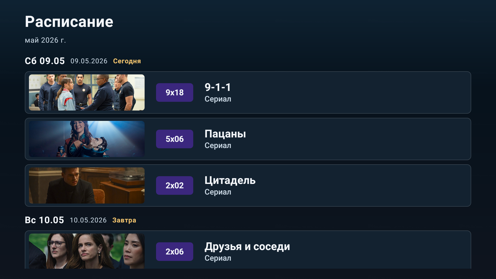

# LostFilm New TV

> **Отказ от ответственности**
>
> Это неофициальный Android TV клиент для `lostfilm.today`. Проект не связан с LostFilm.TV или правообладателями контента.

Android TV приложение для просмотра новых релизов, фильмов, расписания и избранного LostFilm в интерфейсе, рассчитанном на управление пультом.


## Возможности

- Лента новых релизов и отдельный раздел фильмов с `lostfilm.today`
- Поиск по каталогу
- Расписание релизов
- Персональное избранное после входа в аккаунт LostFilm
- QR-авторизация без ввода логина и пароля на телевизоре
- Карточка релиза с постером, описанием, рейтингом TMDB и торрент-раздачами
- Обзор сериала или фильма
- Гид по сезонам и сериям с отметками просмотра
- Запуск воспроизведения через TorrServe
- Канал Android TV Home Channel с фоновым обновлением
- Проверка обновлений приложения через GitHub Releases
- Локальный кеш данных для более стабильной работы

## Скриншоты

| Главный экран | Фильмы |
|---|---|
|  |  |

| Детали релиза | Обзор сериала |
|---|---|
|  |  |

| Гид по сериям | Расписание |
|---|---|
|  |  |

| Настройки | QR-авторизация |
|---|---|
|  |  |

## Требования

| Зависимость | Значение |
|---|---|
| Устройство | Android TV / Google TV |
| Android | 8.0+ (`minSdk = 26`) |
| JDK | 17 |
| Android SDK | compileSdk 35 |
| Python | 3.12 для auth bridge |
| TorrServe | Нужен для воспроизведения, адрес по умолчанию `http://127.0.0.1:8090` |

Аккаунт LostFilm не обязателен для просмотра новых релизов и фильмов, но нужен для избранного и персональных функций.

## Установка

### Скачать APK

1. Откройте страницу [Releases](../../releases/latest).
2. Скачайте debug или release APK.
3. Установите APK на Android TV через ADB или файловый менеджер.

### Собрать из исходников

```bash
git clone https://github.com/kraaton11/new_lostfilmatv.git
cd new_lostfilmatv
./gradlew assembleDebug
```

Debug APK будет доступен здесь:

```text
app/build/outputs/apk/debug/app-debug.apk
```

Установка через ADB:

```bash
adb connect 192.168.x.x:5555
adb install app/build/outputs/apk/debug/app-debug.apk
```

## Разработка

Основные проверки Android-клиента:

```bash
./gradlew testDebugUnitTest lint assembleDebug
```

Отдельные команды:

```bash
./gradlew :app:testDebugUnitTest
./gradlew :app:lint
./gradlew assembleDebug
./gradlew :app:connectedDebugAndroidTest
```

Instrumented UI-тесты требуют подключенного эмулятора или устройства.

Запуск Android TV эмулятора:

```bash
./scripts/run-emulator.sh
```

## Auth Bridge

`backend/auth_bridge` содержит FastAPI-сервис для QR-авторизации. Телевизор создает pairing, показывает QR-код, телефон проходит вход через браузер, после чего приложение получает и сохраняет сессию локально.

Локальный запуск:

```bash
cd backend/auth_bridge
cp .env.example .env
docker compose up -d
```

Тесты backend-сервиса:

```bash
pip install ./backend/auth_bridge/backend
python -m unittest discover -s backend/auth_bridge/backend/tests -p 'test_*.py'
```

Подробности по серверу:

- [auth-bridge-server-install.md](docs/auth-bridge-server-install.md)
- [auth-bridge-ops.md](docs/auth-bridge-ops.md)

## Release-сборка

Release APK собирается через:

```bash
./gradlew assembleRelease
```

Для подписанной сборки нужны переменные окружения:

- `ANDROID_KEYSTORE_PATH` или `ANDROID_KEYSTORE_BASE64`
- `ANDROID_KEYSTORE_PASSWORD`
- `ANDROID_KEY_ALIAS`
- `ANDROID_KEY_PASSWORD`

Версия APK задается Gradle properties:

- `releaseVersionCode`
- `releaseVersionName`

## Стек

- Kotlin, coroutines, Flow
- Jetpack Compose for TV
- Navigation Compose
- Hilt
- Room
- OkHttp
- Jsoup
- Coil
- WorkManager
- kotlinx.serialization
- Python / FastAPI для auth bridge

## Структура репозитория

```text
app/                    Android TV клиент
backend/auth_bridge/    FastAPI сервис для QR-авторизации
docs/                   Документация, скриншоты и служебные материалы
scripts/                Вспомогательные скрипты
```

## Документация

- [docs/README.project.md](docs/README.project.md)
- [docs/github-setup.md](docs/github-setup.md)
- [docs/auth-bridge-server-install.md](docs/auth-bridge-server-install.md)
- [docs/auth-bridge-ops.md](docs/auth-bridge-ops.md)
