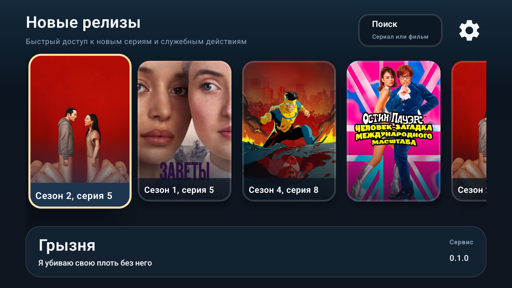
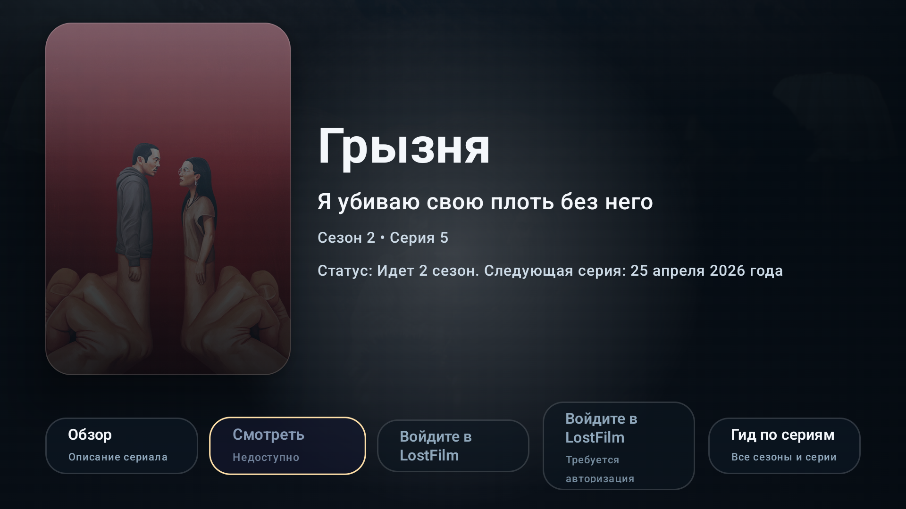
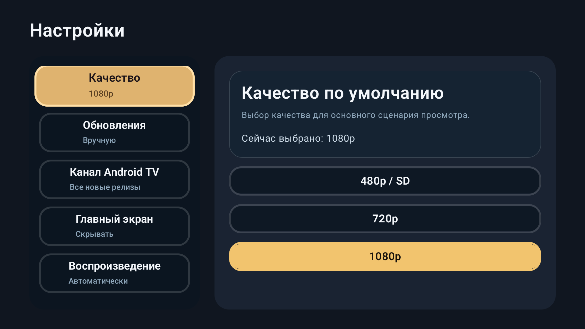

# LostFilm New TV

> ⚠️ **Отказ от ответственности**
> 
> Данное приложение является неофициальным клиентом и не связано с LostFilm.TV. Весь контент принадлежит правообладателям. Приложение лишь предоставляет удобный интерфейс для доступа к сайту lostfilm.tv через Android TV.

Android TV приложение для просмотра новых релизов и избранных сериалов LostFilm в интерфейсе, рассчитанном на управление пультом.

## Что умеет приложение

- Показывает новые релизы с `lostfilm.today`
- Открывает персональное избранное после входа в аккаунт LostFilm
- Использует QR-авторизацию без ввода логина и пароля на телевизоре
- Показывает детали релиза, доступные раздачи и гид по сериям
- Запускает воспроизведение через TorrServe
- Публикует контент в Android TV Home Channel
- Проверяет обновления приложения через GitHub Releases
- Кеширует данные локально для более стабильной работы

## Скриншоты

| Главный экран | Детали релиза |
|---|---|
|  |  |

| Настройки | QR-авторизация |
|---|---|
|  |  |

## Технологии

- Kotlin
- Jetpack Compose for TV
- Navigation Compose
- Room
- OkHttp
- Jsoup
- WorkManager
- Coil
- kotlinx.serialization
- Python / FastAPI для auth bridge

## Требования

- Android TV / Google TV
- Android 8.0+ (`minSdk = 26`)
- JDK 17
- Android SDK 35
- Для воспроизведения нужен TorrServe

## Быстрый старт

```bash
git clone https://github.com/kraaton11/new_lostfilmatv.git
cd new_lostfilmatv
./gradlew assembleDebug
```

APK после сборки:

`app/build/outputs/apk/debug/app-debug.apk`

## Запуск эмулятора

```bash
./scripts/run-emulator.sh
```

Скрипт запускает AVD `tv_test`, нормализует его локальный `config.ini`, поднимает `adb` и ждёт состояния `device`.

## Сборка и проверки

```bash
./gradlew :app:testDebugUnitTest
./gradlew :app:connectedDebugAndroidTest
./gradlew :app:lint
./gradlew assembleRelease
```

Для release-сборки CI использует:

- `releaseVersionCode`
- `releaseVersionName`
- `ANDROID_KEYSTORE_PATH` или `ANDROID_KEYSTORE_BASE64`
- `ANDROID_KEYSTORE_PASSWORD`
- `ANDROID_KEY_ALIAS`
- `ANDROID_KEY_PASSWORD`

## Авторизация

В проекте используется QR flow:

1. Телевизор запрашивает pairing у auth bridge.
2. Пользователь сканирует QR-код телефоном.
3. На телефоне открывается проксируемая страница входа LostFilm.
4. После успешной авторизации TV получает и сохраняет сессию локально.

Обычный ручной импорт cookies в штатном сценарии не нужен.

## Основные экраны

- Home: новые релизы и избранное с переключением одной кнопкой
- Details: карточка релиза, постер, описания, раздачи, действия
- Series Guide: сезоны и эпизоды с состоянием просмотра
- Settings: качество, канал Android TV, обновления, аккаунт

## Структура репозитория

```text
app/                    Android TV клиент
backend/auth_bridge/    FastAPI сервис для QR-авторизации
docs/                   Дополнительная документация по проекту
```

## Документация

- [README.project.md](docs/README.project.md)
- [LostFilmNewTV_Documentation.docx](docs/LostFilmNewTV_Documentation.docx)
- [github-setup.md](docs/github-setup.md)
- [auth-bridge-ops.md](docs/auth-bridge-ops.md)
- [auth-bridge-server-install.md](docs/auth-bridge-server-install.md)
- [google-signin-example.md](docs/google-signin-example.md)
- [2026-03-15-lostfilm-android-tv-design.md](docs/superpowers/specs/2026-03-15-lostfilm-android-tv-design.md)
- [2026-03-15-lostfilm-android-tv.md](docs/superpowers/plans/2026-03-15-lostfilm-android-tv.md)

## Локальный запуск auth bridge

```bash
cd backend/auth_bridge
cp .env.example .env
docker compose up -d
```

## Статус проекта

Проект приватный. Репозиторий используется как основная кодовая база Android TV клиента и backend-сервиса для авторизации.
