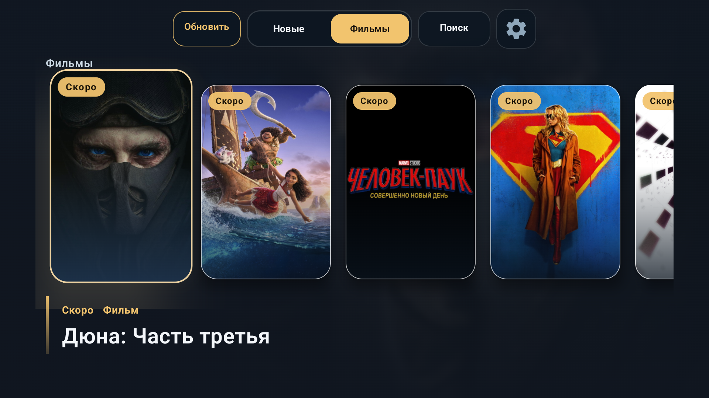
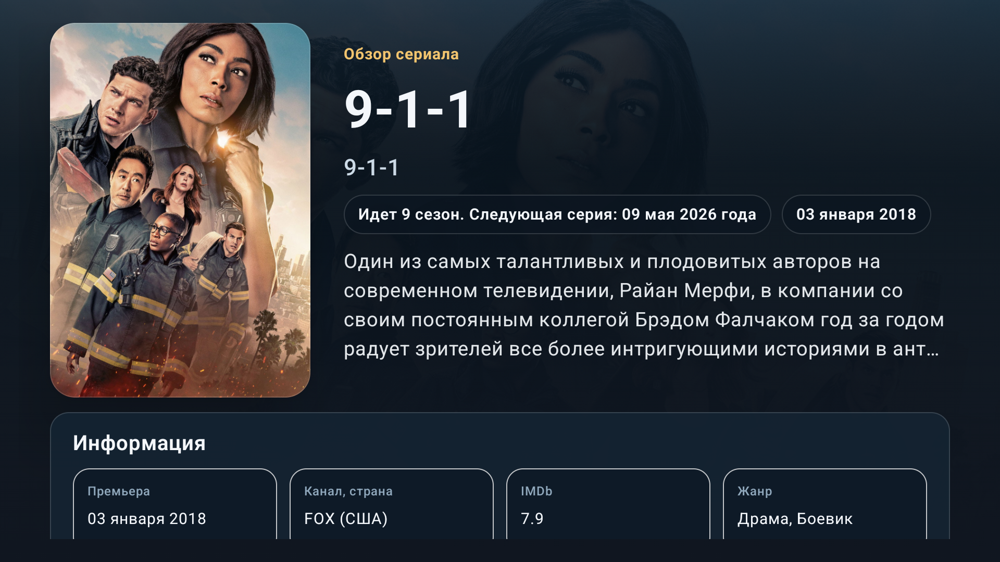
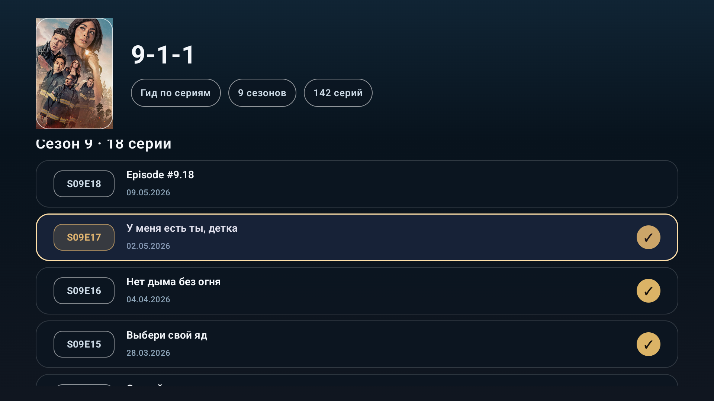

# LostFilm New TV

Приложение для Android TV, которое показывает новые релизы, фильмы и избранные сериалы с [lostfilm.today](https://www.lostfilm.today) в удобном интерфейсе для пульта дистанционного управления.


---

## Возможности

- 📺 **Новые релизы** — лента свежих серий прямо с lostfilm.today
- 🎞️ **Фильмы** — отдельная витрина кино с пагинацией и пометками «Скоро»
- ⭐ **Избранное** — персональная лента из сериалов в вашем аккаунте LostFilm
- 🔐 **Вход через QR-код** — авторизация с телефона, без ввода пароля на ТВ
- 🎬 **Воспроизведение через TorrServe** — запуск торрентов как обычного видео
- 📋 **Гид по сериям** — все сезоны и эпизоды с отметками просмотренного
- 📡 **Канал на главном экране** — виджет Android TV лаунчера с автообновлением
- 🔄 **Автообновление** — проверка новых версий через GitHub Releases
- 💾 **Офлайн-кеш** — последние данные доступны без интернета (до 7 дней)

---

## Скриншоты

> Приложение разработано для управления пультом. Сенсорный экран не используется.

| Главный экран | Фильмы |
|:---:|:---:|
|  |  |

| Детали релиза | Обзор сериала |
|:---:|:---:|
|  |  |

| Гид по сериям | Настройки |
|:---:|:---:|
|  |  |

| QR-авторизация |
|:---:|
|  |

---

## Требования

| | |
|---|---|
| **Платформа** | Android TV / Google TV |
| **Минимальный Android** | API 26 (Android 8.0 Oreo) |
| **TorrServe** | Должен быть запущен на устройстве (`127.0.0.1:8090`) |
| **Аккаунт LostFilm** | Необязателен для просмотра новинок и фильмов, требуется для Избранного |

---

## Установка

### Вариант 1 — скачать APK

1. Перейдите на страницу [Releases](../../releases/latest)
2. Скачайте `.apk` файл
3. Установите на Android TV устройство через ADB или файловый менеджер

### Вариант 2 — собрать из исходников

```bash
# Клонировать репозиторий
git clone https://github.com/kraaton11/new_lostfilmatv.git
cd new_lostfilmatv

# Собрать debug-APK
./gradlew assembleDebug

# Установить на устройство (указать IP вашего TV)
adb connect 192.168.x.x:5555
adb install app/build/outputs/apk/debug/app-debug.apk
```

---

## Авторизация

Приложение использует **QR-авторизацию** — вы входите в LostFilm через браузер на телефоне, а сессия автоматически передаётся на телевизор.

```
TV: показывает QR-код
       ↓
Телефон: сканирует QR → открывает страницу auth.bazuka.pp.ua
       ↓
Телефон: входит в LostFilm как обычно через браузер
       ↓
TV: автоматически получает сессию и сохраняет её
```

Логин и пароль на телевизоре вводить **не нужно**. Сессия хранится локально в зашифрованном виде (AES-256-GCM) и действует 7 дней.

---

## Управление пультом

| Кнопка | Действие |
|---|---|
| **Стрелки** | Навигация по карточкам и меню |
| **OK / Enter** | Выбрать / открыть |
| **Назад** | Вернуться на предыдущий экран |
| **Menu (☰)** | Переключить ленту: Новые релизы ↔ Избранное |

---

## Настройки

В настройках приложения можно настроить:

- **Качество по умолчанию** — 480p / 720p / 1080p (выбирается автоматически при открытии)
- **Канал на главном экране** — Отключён / Все новые / Непросмотренные
- **Избранное на главном экране** — включить/выключить раздел
- **Автообновление** — автоматически в фоне / только вручную
- **Аккаунт** — вход и выход

---

## Технологии

| | |
|---|---|
| **Язык** | Kotlin |
| **UI** | Jetpack Compose (TV / Leanback) |
| **Навигация** | Jetpack Navigation Compose |
| **Сеть** | OkHttp |
| **HTML-парсинг** | Jsoup |
| **База данных** | Room (SQLite) |
| **Фоновые задачи** | WorkManager |
| **Авторизация** | EncryptedSharedPreferences (AES-256-GCM) |
| **Изображения** | Coil |
| **Сериализация** | kotlinx.serialization |
| **Auth Bridge** | Python / FastAPI |

---

## Архитектура

```
┌─────────────────────────────────────────┐
│              UI (Compose)               │
│   HomeScreen  DetailsScreen  AuthScreen │
└─────────────┬───────────────────────────┘
              │ StateFlow
┌─────────────▼───────────────────────────┐
│           ViewModel (MVVM)              │
│  HomeViewModel  DetailsViewModel  ...   │
└─────────────┬───────────────────────────┘
              │ suspend fun
┌─────────────▼───────────────────────────┐
│         Repository                      │
│   LostFilmRepositoryImpl                │
│   Кеш 6 ч (fresh) / 7 дней (retain)    │
└──────┬──────────────────┬───────────────┘
       │                  │
┌──────▼──────┐    ┌──────▼──────┐
│   Network   │    │    Room     │
│  OkHttp     │    │  Database   │
│  Jsoup      │    │  DAO / SQL  │
└─────────────┘    └─────────────┘
```

---

## Auth Bridge

Отдельный Python/FastAPI сервис для QR-авторизации. Исходники: [`backend/auth_bridge/`](backend/auth_bridge/)

Публичный сервер: `https://auth.bazuka.pp.ua`

### Запуск локального сервера

```bash
cd backend/auth_bridge
cp .env.example .env
# Настройте .env под ваш домен
docker compose up -d
```

### Обновление на продакшн-сервере

```bash
ssh ubuntu@<server>
cd /home/ubuntu/lostfilm-auth-bridge
docker compose pull auth-backend
docker compose up -d auth-backend
```

---

## Структура проекта

```
├── app/src/main/java/.../
│   ├── data/
│   │   ├── auth/          # Авторизация, EncryptedSessionStore
│   │   ├── db/            # Room: entities, DAO, Database
│   │   ├── model/         # Доменные модели
│   │   ├── network/       # HTTP-клиенты, AuthBridgeClient
│   │   ├── parser/        # HTML-парсеры (Jsoup)
│   │   └── repository/    # LostFilmRepositoryImpl
│   ├── ui/
│   │   ├── home/          # Главный экран
│   │   ├── details/       # Экран деталей релиза
│   │   ├── guide/         # Гид по сериям
│   │   ├── auth/          # QR-авторизация
│   │   └── settings/      # Настройки
│   ├── navigation/        # AppNavGraph, AppDestination
│   ├── tvchannel/         # Android TV Channel + WorkManager
│   ├── platform/torrserve/ # TorrServe интеграция
│   ├── updates/           # Автообновление через GitHub
│   └── playback/          # PlaybackPreferencesStore
└── backend/auth_bridge/   # Python/FastAPI Auth Bridge
```

---

## Разработка

### Требования для сборки

- Android Studio Hedgehog или новее
- JDK 17+
- Android SDK с API 26–35

### Сборка и тесты

```bash
# Unit-тесты
./gradlew :app:testDebugUnitTest

# Инструментальные тесты (нужен эмулятор или устройство)
./gradlew :app:connectedDebugAndroidTest

# Lint
./gradlew :app:lint

# Debug APK
./gradlew assembleDebug
```

---

## Лицензия

Проект является приватным. Все права защищены.
